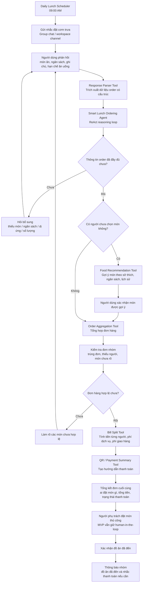
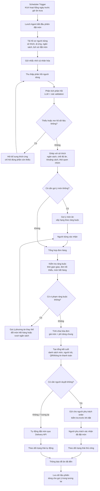

# Báo cáo Cá nhân: Lab 3 - Chatbot vs ReAct Agent

* **Họ và tên**: Phạm Mai Hạnh
* **Mã sinh viên**: 2A202600883
* **Ngày nộp**: 2026-06-01

---

## I. Đóng góp kỹ thuật (15 điểm)

Trong bài lab này, vai trò chính của tôi là phát triển và đánh giá hai thành phần quan trọng của hệ thống **Smart Lunch Ordering Agent**:

1. **Chatbot baseline**
2. **ReAct Agent**

Bên cạnh đó, tôi cũng tham gia kiểm thử hệ thống, phân tích lỗi và so sánh hiệu quả giữa chatbot thông thường và agent có khả năng gọi công cụ.

Các thành viên khác trong nhóm hỗ trợ triển khai các phần liên quan đến công cụ, tích hợp và hoàn thiện hệ thống.

### 1. Các module tôi phụ trách

#### Chatbot baseline

Tôi phụ trách xây dựng chatbot baseline dùng để so sánh với ReAct Agent.

Chatbot baseline có nhiệm vụ:

* phản hồi trực tiếp câu hỏi của người dùng,
* xử lý các yêu cầu đơn giản,
* đưa ra câu trả lời hội thoại thông thường,
* làm mốc so sánh với agent có khả năng dùng tool.

Chatbot phù hợp với các câu hỏi đơn giản như:

* “Hệ thống đặt cơm trưa hoạt động như thế nào?”
* “Tôi có thể đặt món bằng cách nào?”
* “Ai là người tổng hợp đơn?”

Tuy nhiên, chatbot không phù hợp với các tác vụ cần thao tác dữ liệu thật như tìm món, đặt món, kiểm tra ai chưa đặt và tính tiền.

#### ReAct Agent

Tôi phụ trách logic chính của ReAct Agent. Agent được thiết kế theo vòng lặp:

**Thought → Action → Observation → Thought → Action → Observation → Final Answer**

Trong đó:

* **Thought**: Agent phân tích yêu cầu của người dùng.
* **Action**: Agent chọn công cụ phù hợp và sinh tham số gọi tool.
* **Observation**: Tool trả kết quả thực tế về cho agent.
* **Final Answer**: Agent tổng hợp kết quả cuối cùng cho người dùng.

ReAct Agent có thể xử lý các tác vụ nhiều bước như:

* tìm món ăn theo ngân sách,
* lọc món không cay,
* đặt món cho người dùng,
* kiểm tra ai chưa đặt món,
* tổng hợp đơn hàng,
* tính tổng tiền,
* chia hóa đơn cho từng thành viên.

#### Vai trò tester

Ngoài phát triển logic chatbot và agent, tôi cũng đảm nhiệm vai trò kiểm thử.

Các nhóm test chính gồm:

* test chatbot với câu hỏi đơn giản,
* test agent với yêu cầu nhiều bước,
* test việc gọi tool,
* test lỗi thiếu thông tin,
* test lỗi hallucination,
* test trường hợp tool trả kết quả rỗng,
* test so sánh chatbot và agent.

### 2. Các công cụ chính trong hệ thống

| Công cụ      | Chức năng                                          |
| ------------ | -------------------------------------------------- |
| `menu_tool`  | Tìm món ăn theo giá, loại món, độ cay hoặc từ khóa |
| `order_tool` | Thêm, cập nhật, lấy danh sách hoặc xóa đơn hàng    |
| `bill_tool`  | Tính tổng tiền và chia hóa đơn                     |
| `user_tool`  | Kiểm tra người chưa đặt món hoặc chưa thanh toán   |

Điểm khác biệt quan trọng là chatbot chỉ trả lời bằng ngôn ngữ tự nhiên, còn ReAct Agent có thể tương tác với công cụ để lấy dữ liệu thật và cập nhật trạng thái đơn hàng.

### 3. Cách code tương tác với ReAct loop

Khi người dùng gửi yêu cầu, agent không trả lời ngay. Thay vào đó, agent phân tích yêu cầu, xác định công cụ cần dùng, gọi tool, đọc kết quả trả về, rồi mới quyết định bước tiếp theo.

Ví dụ:

Người dùng yêu cầu:

> “Tìm món dưới 50k và đặt cho tôi.”

Agent xử lý theo các bước:

1. Dùng `menu_tool` để tìm món dưới 50k.
2. Đọc kết quả trả về từ tool.
3. Chọn món hợp lệ.
4. Dùng `order_tool` để đặt món.
5. Trả lại xác nhận cuối cùng cho người dùng.

Cách xử lý này đáng tin cậy hơn chatbot thông thường vì kết quả được dựa trên dữ liệu từ tool thay vì chỉ dựa vào kiến thức có sẵn của mô hình.

---

## II. Case Study Debugging (10 điểm)

### 1. Mô tả vấn đề

Một lỗi quan trọng trong quá trình kiểm thử là agent bị **hallucination sau khi gọi tool**.

Ví dụ, người dùng nhập:

> “Tôi muốn tìm các món ăn dưới 50k và không cay.”

Agent đã gọi đúng `menu_tool` với tham số:

```json
{
  "max_price": 50000,
  "spicy": false
}
```

Tuy nhiên, sau khi nhận kết quả từ tool, agent lại tạo ra một món không tồn tại trong dữ liệu thực đơn.

### 2. Nguồn log

Lỗi được phát hiện thông qua quá trình kiểm thử và đối chiếu giữa:

* input của người dùng,
* action do agent sinh ra,
* observation từ tool,
* câu trả lời cuối cùng của agent.

Vấn đề chính không nằm ở tool call, vì agent đã gọi đúng công cụ. Lỗi nằm ở phần agent tổng hợp câu trả lời cuối cùng nhưng không tuân thủ tuyệt đối dữ liệu từ observation.

### 3. Chẩn đoán nguyên nhân

Nguyên nhân chính là agent vẫn sử dụng kiến thức tiền huấn luyện của mô hình thay vì chỉ dựa trên dữ liệu tool trả về.

Điều này cho thấy việc sử dụng tool không tự động loại bỏ hallucination. Nếu prompt không ràng buộc đủ chặt, agent vẫn có thể tự tạo thêm thông tin không có trong observation.

| Nguồn lỗi | Phân tích                                                           |
| --------- | ------------------------------------------------------------------- |
| Prompt    | Chưa ép agent chỉ được dùng dữ liệu từ observation                  |
| Model     | Mô hình có xu hướng tự hoàn thiện câu trả lời bằng kiến thức sẵn có |
| Tool spec | Tool hoạt động đúng, nhưng agent không tuân thủ kết quả tool        |

### 4. Giải pháp

Cần bổ sung strict mode vào system prompt:

> Agent chỉ được trả lời dựa trên dữ liệu trong Observation mới nhất. Nếu Observation không có kết quả hợp lệ, agent phải nói rằng không tìm thấy món phù hợp, không được tự tạo món mới.

Ngoài ra, trước khi trả lời cuối cùng, agent cần kiểm tra:

1. Món được đề xuất có tồn tại trong kết quả tool không.
2. Giá món có đúng điều kiện người dùng đưa ra không.
3. Thuộc tính món có phù hợp không, ví dụ không cay, đúng loại món, đúng ngân sách.
4. Nếu không có món phù hợp, trả lời rõ ràng là không tìm thấy kết quả.

---

## III. Nhận xét cá nhân: Chatbot vs ReAct Agent (10 điểm)

### 1. Reasoning: Thought block giúp agent tốt hơn chatbot như thế nào?

`Thought` block giúp agent chia nhỏ yêu cầu của người dùng thành các bước xử lý cụ thể.

Chatbot thông thường thường trả lời ngay. Ngược lại, ReAct Agent có thể suy nghĩ trước khi hành động:

* cần dùng tool nào,
* cần tham số nào,
* đã đủ thông tin chưa,
* bước tiếp theo là gì.

Ví dụ với yêu cầu:

> “Tìm món dưới 50k, đặt cho tôi và tính tiền.”

Chatbot có thể chỉ đưa ra gợi ý chung. Trong khi đó, ReAct Agent có thể xử lý theo quy trình:

1. Tìm món bằng `menu_tool`.
2. Đặt món bằng `order_tool`.
3. Tính tiền bằng `bill_tool`.
4. Trả kết quả cuối cùng.

Vì vậy, `Thought` block giúp agent phù hợp hơn với các tác vụ có nhiều bước và cần thao tác trên dữ liệu thực.

### 2. Reliability: Trường hợp nào agent kém hơn chatbot?

Agent không phải lúc nào cũng tốt hơn chatbot.

Agent có thể kém hơn chatbot trong các trường hợp:

* câu hỏi quá đơn giản,
* câu hỏi chỉ cần giải thích,
* người dùng chỉ chào hỏi,
* không cần gọi tool,
* tool schema chưa rõ,
* tool trả kết quả rỗng,
* agent sinh JSON sai,
* agent bị lặp quá nhiều bước.

Trong các trường hợp đơn giản, chatbot có lợi thế hơn vì:

* phản hồi nhanh hơn,
* ít tốn token hơn,
* ít phức tạp hơn,
* dễ kiểm soát hơn.

ReAct Agent phù hợp hơn khi bài toán yêu cầu thao tác nhiều bước hoặc cần dữ liệu thật từ hệ thống.

### 3. Observation ảnh hưởng đến bước tiếp theo như thế nào?

Observation là phản hồi thực tế từ môi trường sau khi agent gọi tool.

Observation giúp agent biết:

* tool có tìm thấy món không,
* đơn hàng đã được thêm chưa,
* ai chưa đặt món,
* tổng tiền hiện tại là bao nhiêu,
* có lỗi xảy ra khi gọi tool không.

Ví dụ:

* Nếu `menu_tool` trả về danh sách món hợp lệ, agent có thể chọn món và tiếp tục đặt hàng.
* Nếu `menu_tool` trả về rỗng, agent nên hỏi người dùng có muốn đổi điều kiện không.
* Nếu `user_tool` phát hiện có người chưa đặt, agent có thể nhắc người đó.
* Nếu `bill_tool` tính được tổng tiền, agent có thể tạo summary thanh toán.

Nhờ observation, agent không phải đoán mà có thể điều chỉnh hành động dựa trên trạng thái thật của hệ thống.

---

## IV. Thiết kế Workflow

### 1. Workflow MVP: Smart Lunch Ordering Agent hiện tại

Workflow này mô tả prototype hiện tại. Hệ thống hỗ trợ nhắc đặt cơm, thu thập phản hồi, phân tích order, gợi ý món nếu cần, tổng hợp đơn và chia hóa đơn. Ở bản MVP, bước đặt đồ ăn cuối cùng vẫn do con người thực hiện để giảm rủi ro.



### 2. Workflow Version 1: Phiên bản cải tiến

Workflow Version 1 mở rộng prototype thành một sản phẩm hoàn chỉnh hơn. Các cải tiến chính gồm cá nhân hóa, kiểm tra ràng buộc tốt hơn, hỗ trợ thanh toán, theo dõi trạng thái đơn và lưu lịch sử để gợi ý tốt hơn trong tương lai.



---

## V. Cải tiến tương lai (5 điểm)

Để mở rộng prototype thành hệ thống AI agent có thể dùng trong môi trường thực tế, tôi đề xuất cải thiện theo bốn hướng chính.

### 1. Khả năng mở rộng

Prototype hiện tại phù hợp với nhóm nhỏ. Nếu triển khai cho nhiều nhóm hoặc toàn công ty, hệ thống cần kiến trúc ổn định hơn.

Đề xuất cải tiến:

* thay in-memory storage bằng PostgreSQL hoặc MongoDB,
* dùng asynchronous queue cho tool call,
* tách chatbot, agent, tool service và database thành các service riêng,
* thêm session management cho từng nhóm đặt cơm,
* cache menu và sở thích người dùng để giảm latency.

### 2. An toàn hệ thống

Agent không nên tự thực hiện hành động có rủi ro cao nếu chưa được kiểm tra. Trong bài toán đặt cơm, rủi ro chính gồm đặt sai món, tính sai tiền và hallucination món không tồn tại.

Đề xuất cải tiến:

* validate schema cho mọi input do agent sinh ra,
* thêm supervisor layer để kiểm tra câu trả lời cuối,
* bắt buộc agent chỉ trả lời từ tool observation,
* yêu cầu người dùng xác nhận trước khi đặt món thật,
* thêm giới hạn ngân sách và xác nhận trước khi thanh toán.

### 3. Hiệu năng

ReAct Agent mạnh hơn chatbot nhưng chậm hơn và tốn chi phí hơn vì có thể cần nhiều vòng gọi LLM.

Đề xuất cải tiến:

* dùng chatbot cho câu hỏi FAQ đơn giản,
* chỉ dùng ReAct Agent cho tác vụ vận hành cần tool,
* đặt `temperature = 0` để kết quả ổn định hơn,
* giới hạn số bước reasoning,
* dùng model nhỏ hoặc local model cho tác vụ ít rủi ro,
* dùng vector search nếu số lượng tool hoặc món ăn tăng lớn.

### 4. Cải tiến sản phẩm Version 1

Version 1 nên chuyển từ prototype lab sang trợ lý đặt cơm thực tế.

Các tính năng nên có:

* lưu hồ sơ người dùng,
* xử lý dị ứng và chế độ ăn đặc biệt,
* kiểm tra order trùng lặp,
* thay thế món hết hàng,
* tạo QR thanh toán,
* theo dõi trạng thái đơn,
* tích hợp thông báo qua Slack, Zalo hoặc Microsoft Teams,
* lưu lịch sử đặt món để gợi ý tốt hơn.

---

## VI. Kết luận

Trong bài lab này, tôi chủ yếu đóng góp vào phần phát triển và kiểm thử **Chatbot baseline** và **ReAct Agent**.

Kết luận quan trọng nhất là chatbot thông thường phù hợp với hội thoại đơn giản, nhưng chưa đủ tin cậy cho các workflow nhiều bước cần thao tác dữ liệu thật.

ReAct Agent mạnh hơn vì có thể:

* suy luận,
* gọi công cụ,
* đọc observation,
* tiếp tục hành động dựa trên phản hồi từ môi trường.

Tuy nhiên, agent cũng tạo ra rủi ro mới như:

* hallucination,
* latency cao hơn,
* chi phí token cao hơn,
* khó debug hơn,
* phụ thuộc nhiều vào tool schema.

Với Smart Lunch Ordering Agent, thiết kế dài hạn hợp lý nhất là mô hình hybrid:

* dùng chatbot cho câu hỏi đơn giản,
* dùng ReAct Agent cho workflow cần gọi tool,
* dùng validation và human approval cho bước đặt món và thanh toán.

Cách tiếp cận này giúp cân bằng giữa tốc độ, chi phí, độ tin cậy và khả năng ứng dụng thực tế.
